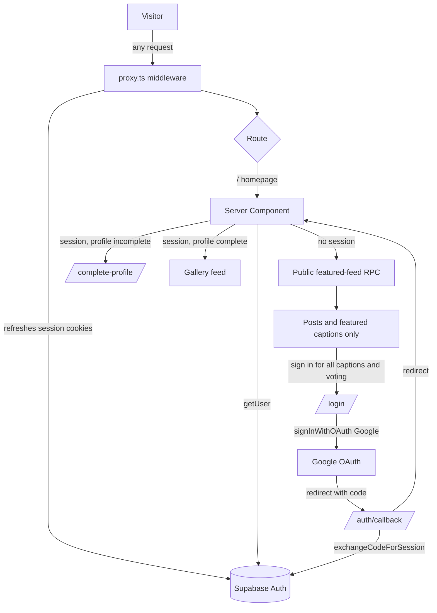
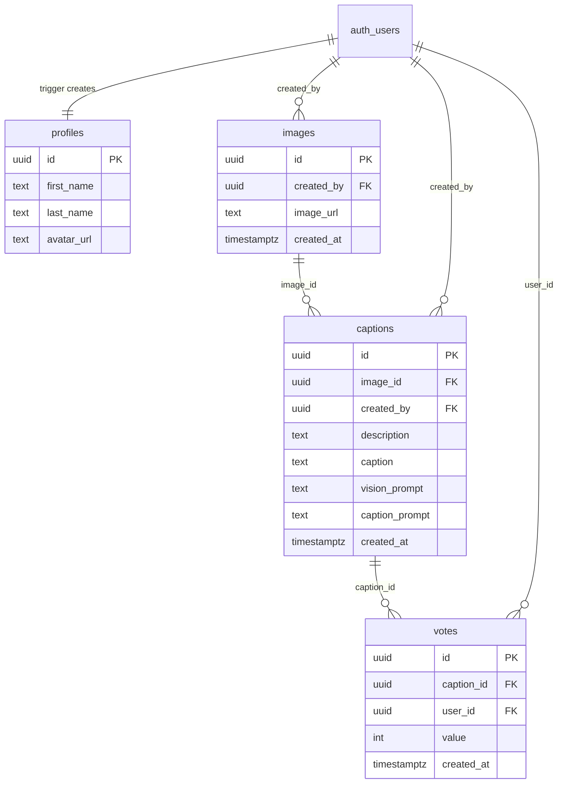
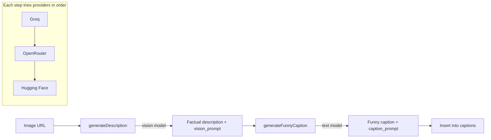

# Architecture

How Crackd fits together: the auth flow, the data model, and the AI
caption pipeline.

## Request / auth flow

- **`proxy.ts`** (Next.js middleware) runs `lib/supabase/middleware.ts` on
  every matched request to keep the Supabase session cookies fresh. This is
  required because Server Components cannot write cookies.
- **Server Components** (`app/page.tsx`, `app/profile/page.tsx`) call
  `supabase.auth.getUser()`. The homepage allows public browsing through
  `public_featured_feed()` and redirects signed-in users missing first/last
  name to `/complete-profile`. Profile requires sign-in on the server and
  renders the interactive account form, including the signed-in welcome
  alongside account settings.
- **`app/auth/callback/route.ts`** is the OAuth (PKCE) redirect target; it
  exchanges the `code` for a session and sends the user back into the app.

## Data model

- A `profiles` row is auto-created on first login by the `handle_new_user`
  trigger on `auth.users` (runs `security definer`, so it bypasses RLS).
- Foreign keys cascade on delete: removing an image removes its captions and
  votes; removing a user removes everything they own.
- `votes` has a unique `(user_id, caption_id)` constraint — one vote per user
  per caption.

See [the full RLS posture](./conventions.md#row-level-security-rls).

## AI caption pipeline

- `lib/groq.ts` runs a two-step pipeline: a vision model produces a factual
  description, then a text model turns it into a caption.
- Each step calls `chatWithFallback`, which tries **Groq → OpenRouter →
  Hugging Face** and returns the first non-empty response. All three are
  OpenAI-compatible, so the same `openai` SDK is reused with different base
  URLs — server-side only (the keys have no `NEXT_PUBLIC_` prefix).
- The literal prompt text for **both** steps is returned and persisted on the
  caption row (`vision_prompt`, `caption_prompt`), so every AI generation is
  traceable to the inputs that produced it. The UI exposes them via the
  "View prompt" disclosure on each caption.

## Posting, voting & ownership

- Mutations run through **server actions** in `app/actions.ts`. Editing,
  deleting, and caption generation require post ownership. Generation loads
  the stored image URL after checking ownership rather than trusting a
  client-supplied URL. Caption-insert RLS also checks parent-post ownership.
- Authenticated users can read all captions and vote. Signed-out visitors
  receive only a featured caption and aggregate score through a narrow RPC;
  raw captions, prompts, and vote records remain inaccessible to them.
- Voting delegates to the `toggle_vote` Postgres function so the
  read-then-write is atomic (two fast clicks can't both see "no existing vote"
  and race past the undo branch). `app/ImageCard.tsx` mirrors that logic with
  `useOptimistic` for instant feedback.

## Images & storage

- Uploaded files go to Supabase Storage (`images` / `avatars` buckets); only
  the resulting public URL is stored in Postgres (binary data is never stored
  in the database).
- `next.config.ts` allowlists the Supabase Storage host so `next/image` can
  optimize those images. Arbitrary user-pasted URLs render `unoptimized`
  instead, since every external host can't be safely allowlisted.
